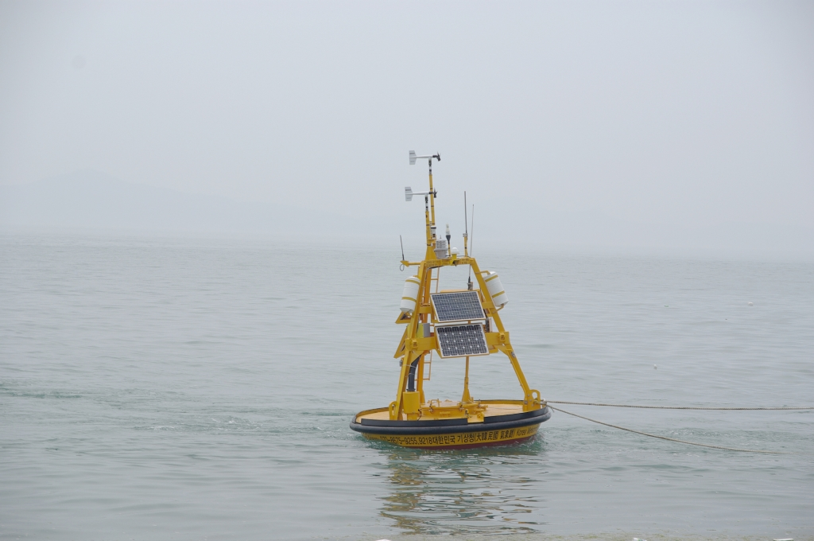

# Seafood Price Model
> AI model that predicts seafood prices based on marine weather observation information.  
> [kaggle competition](https://www.kaggle.com/c/19981126-tp)

## 문제 설명

 학교 앞 조개구이 집에서 아르바이트를 하던 병준이는 가게의 운영과 다양한 해산물의 종류, 특징을 파악하며 자연스레  한 가지 문제점을 깨달았습니다. 바로 조개를 포함한 수산물들의 가격이 변동되어 준비해 둘 수 있는 재고가 예상치를 벗어나는 경우입니다. 해산물의 특성상 신선함을 위해 대부분 전날 밤 발주를 통해 당일 재고를 수급하게 되는데, 갑작스러운 가격 변동이나 재고 소진이 발생하게 되면 판매 계획에 차질이 생깁니다. 이 경우 발주 정보는 수정이 불가피해지며, 어업 종사자들로부터 도매상을 거쳐 소상공인에게까지 전달이 되는 비생산적인 상황이 발생하게 됩니다. 이는 보다 신선한 해산물을 필요로 하는 많은 소상공인들에게 가게 운영에 있어 경제적 타격, 소비자 만족도와 직결되는 문제이기도 합니다.

 외식업계에서 해산물 재료가 차지하는 비중은 매우 크며, 소비자 기준 만족도만 보더라도 해당 업계 시장 규모는 무시할 수 없는 정도입니다. 많은 소상공인들은 가게 운영을 위해 계획적인 해산물 재료 수급과 관리를 필요로 합니다. 따라서 병준이는 여러분과 함께 본 프로젝트를 통해 해산물 판매 소상공인들에게 도움이 될 수 있는 인공지능 모델을 개발해보고자 합니다.

## 데이터셋 구성

제공되는 데이터셋의 경우 아래의 두 데이터를 날짜 기준(2021-01-04 ~ 2021-09-06)으로 합친 데이터입니다.

### 해양 기상 관측 정보

> 해양기상부이: 해수면에서 다양한 기상장비로 해양기상현상을 관측하는 장치

- 본 데이터는 기상청에서 제공하며, 해양기상부이를 이용하여 관측한 정보를 담고 있습니다.
- 원본 데이터는 [링크](https://data.kma.go.kr/data/sea/selectBuoyRltmList.do?pgmNo=52)에서 확인 할 수 있습니다.
- 가공된 데이터는 해산물 조업이 원활하게 이루어지는 동해 지역의 네 지점 (동해, 울산, 울진, 포항)에서 뽑아 구성하였습니다.

### 농축수산물 일자별 도소매 가격
> 일반농산물 도매 69품목 116품종, 소매 90품목 143품종 및 친환경농산물 38품목 44종 대상

- 본 데이터는 매일 조사하는 일반농산물 및 친환경농산물의 가격자료를 담은 데이터입니다.
- 원본 데이터는 [링크](https://www.data.go.kr/data/15072357/fileData.do)에서 확인할 수 있습니다.
- 가공된 데이터는 대표적 해산물 품목인 '갈치' 가격을 담고 있습니다.

데이터 셋은 해양 기상 관측 정보 ['지점', '일시', '평균 풍속(m/s)', '평균기압(hPa)', '평균 상대습도(%)', '평균 기온(°C)', '평균 수온(°C)', '평균 최대 파고(m)', '평균 유의 파고(m)', '최고 유의 파고(m)', '최고 최대 파고(m)', '평균 파주기(sec)', '최고 파주기(sec)'], 가격과 관련된 데이터 ['시도명', 'price'] 로 구성됩니다. 자세한 내용은 Data tab을 참고해주세요.

## 주의 사항

한글 데이터 로드 문제는 **CP949 encoding**으로 해결하시면 됩니다.
